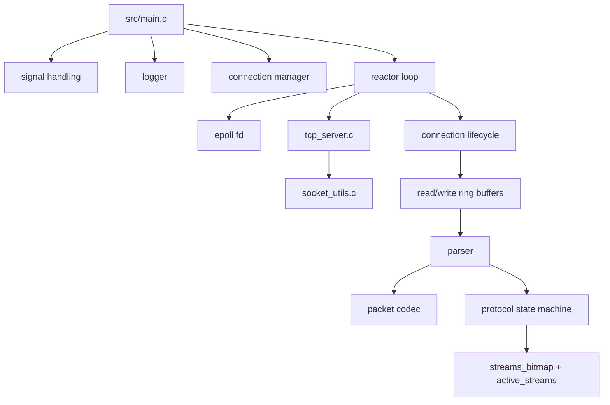
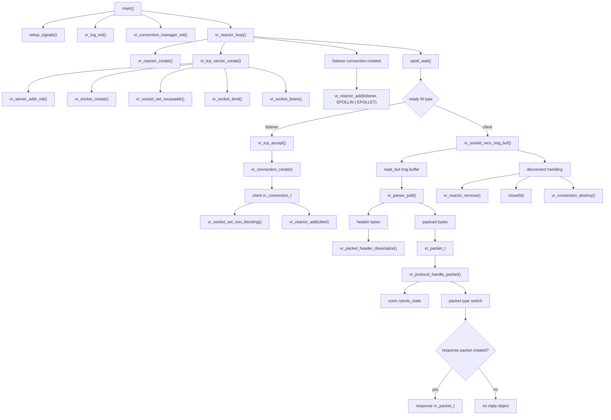

# Velora

## Project summary

Velora is a C-based network server project built around an epoll-driven event loop, raw TCP sockets, a binary packet protocol, and per-connection state. Based on the current code in this repository, the project is primarily a lightweight event-driven socket server and protocol handling framework rather than a complete messaging product with a fully implemented broker, worker pool, or application layer.

This summary is grounded only in the existing runtime code and headers under [src](src), [include/velora](include/velora), and [include/shared](include/shared). It intentionally excludes the scripts under [tests](tests).

---

## High-level architecture



### Architectural interpretation

The actual structure is layered like this:

1. Process entry and lifecycle management in [src/main.c](src/main.c)
2. Event loop management in [src/event_loop/reactor.c](src/event_loop/reactor.c)
3. Socket creation, bind, accept, and I/O helpers in [src/net/tcp_server.c](src/net/tcp_server.c) and [src/net/socket_utils.c](src/net/socket_utils.c)
4. Connection tracking and socket state in [src/conn/conn.c](src/conn/conn.c)
5. Per-connection buffering in [src/conn/ring_buffer.c](src/conn/ring_buffer.c)
6. Binary packet parsing in [src/protocol/parser.c](src/protocol/parser.c)
7. Protocol state handling in [src/protocol/protocol.c](src/protocol/protocol.c)
8. Logging and error reporting in [src/core/logger.c](src/core/logger.c) and [src/core/error.c](src/core/error.c)

---

## Runtime data flow



### Actual call chain in the code

From the event loop in [src/event_loop/reactor.c](src/event_loop/reactor.c):

- `vr_reactor_loop()` creates the epoll instance and binds the listen socket
- a listener connection is registered with epoll
- `vr_tcp_accept()` accepts new client connections
- each accepted client becomes a `vr_connection_t`
- `vr_socket_recv_ring_buf()` fills that connection's `read_buf`
- `vr_parser_poll()` drains bytes from `read_buf` to reconstruct a packet
- `vr_protocol_handle_packet()` examines the parsed packet and connection state
- the loop may close and destroy the connection when a client disconnects or errors occur

---

## Core components and responsibilities

### 1. Entry point

- [src/main.c](src/main.c)
- `main()` initializes signal handling, logger, connection manager, and the reactor loop
- `handle_shutdown()` flips the process-wide `running_status` when SIGINT or SIGTERM is received

### 2. Reactor / event loop

- [src/event_loop/reactor.c](src/event_loop/reactor.c)
- Defines `vr_reactor_t` with:
  - `epoll_fd`
  - `events[]`
  - `ready_events`
- Provides:
  - `vr_reactor_create()`
  - `vr_reactor_destroy()`
  - `vr_reactor_add()`
  - `vr_reactor_wait()`
  - `vr_reactor_remove()`
  - `vr_reactor_loop()`

This is the main execution engine. It uses epoll to watch file descriptors and route events to listener or client code paths.

### 3. TCP networking

- [include/velora/net.h](include/velora/net.h)
- [src/net/tcp_server.c](src/net/tcp_server.c)
- [src/net/socket_utils.c](src/net/socket_utils.c)

Responsibilities:

- `vr_tcp_server_create()` creates the listening socket
- `vr_server_addr_init()` configures `sockaddr_in`
- `vr_socket_create()` creates the socket descriptor
- `vr_socket_bind()` binds the socket
- `vr_socket_listen()` begins listening
- `vr_tcp_accept()` accepts incoming connections and stores client address info
- `vr_socket_recv_ring_buf()` reads socket data into a connection ring buffer
- `vr_socket_send()` and `vr_socket_send_all()` send data to sockets
- `vr_socket_set_non_blocking()` sets O_NONBLOCK mode

### 4. Connection manager and connection objects

- [include/velora/conn.h](include/velora/conn.h)
- [src/conn/conn.c](src/conn/conn.c)

The central runtime object is `vr_connection_t`, which contains:

- `vr_net_conn_t net_conn`
- `vr_connection_status_t status`
- `vr_connection_type_t type`
- `slot`
- `vr_connection_ring_buf_t read_buf`
- `vr_connection_ring_buf_t write_buf`
- `vr_parser_t parser`
- `vr_protocol_state_t proto_state`
- `active_streams`
- `streams_bitmap[4]`

The connection manager keeps a dynamic array of connection pointers and manages creation and destruction. It also reallocates the slot array when needed.

### 5. Ring buffers

- [src/conn/ring_buffer.c](src/conn/ring_buffer.c)

The ring buffer is used to store pending socket data without a dedicated message queue. It supports:

- initialization
- size/free checks
- push/pop operations
- growth to a max size of `VR_CONNECTION_BUFFER_MAX_SIZE`
- state tracking (`UNALLOC`, `ACTIVE`, `FULL`)

The parser removes bytes from the connection's `read_buf` as it reconstructs packet headers and payloads from the incoming stream.

### 6. Packet format

- [include/velora/packet.h](include/velora/packet.h)
- [src/protocol/packet.c](src/protocol/packet.c)

The implemented binary packet layout is:

- `magic` (2 bytes)
- `version` (1 byte)
- `type` (1 byte)
- `stream_id` (1 byte)
- `flags` (1 byte)
- `payload_len` (2 bytes)

This is serialized and deserialized in the packet code. The protocol uses `VR_MAGIC = 0x5789` and `VR_PROTOCOL_VERSION = 1`.

### 7. Packet parsing

- [include/velora/parser.h](include/velora/parser.h)
- [src/protocol/parser.c](src/protocol/parser.c)

This parser has two states:

- `VR_PARSER_HEADER_WAIT`
- `VR_PARSER_PAYLOAD_WAIT`

It performs the following:

- waits until enough bytes exist for a header
- reads the header from `read_buf`
- validates magic, version, type, and flags
- waits for enough bytes for the payload
- allocates memory for the payload
- copies payload bytes out of the ring buffer
- emits a `vr_packet_t`

If validation fails, it resets and returns an error.

### 8. Protocol state machine

- [include/velora/protocol.h](include/velora/protocol.h)
- [src/protocol/protocol.c](src/protocol/protocol.c)

Connection protocol states implemented in the code:

- `VR_PROTO_INIT`
- `VR_PROTO_CONNECTING`
- `VR_PROTO_ESTABILISHED`
- `VR_PROTO_CLOSED`

Packet types implemented:

- `VR_PKT_CONNECT`
- `VR_PKT_CONNECT_ACK`
- `VR_PKT_PING`
- `VR_PKT_PONG`
- `VR_PKT_STREAM_OPEN`
- `VR_PKT_STREAM_OPEN_ACK`
- `VR_PKT_STREAM_CLOSE`
- `VR_PKT_PUBLISH`
- `VR_PKT_ERROR`

The protocol handler updates:

- connection state
- `streams_bitmap`
- `active_streams`
- response packet type depending on packet context

### 9. Logging and error reporting

- [src/core/logger.c](src/core/logger.c)
- [src/core/error.c](src/core/error.c)
- [include/velora/logger.h](include/velora/logger.h)
- [include/velora/error.h](include/velora/error.h)

The logger is compiled conditionally: when `VR_DEBUG` is enabled, it writes to `log.txt` and uses a mutex; otherwise it becomes a no-op.

Error helpers convert enumerated error values to strings and log strerror(errno) through `vr_perror()`.

---

## What is fully connected today

From the code as written, the following paths are active:

- listener socket creation
- accept loop
- connection creation
- non-blocking client socket setup
- epoll readiness processing
- in-memory byte accumulation in ring buffers
- packet parsing from the buffer
- protocol-state evaluation

---

## What is not fully wired in the current runtime flow

The current code contains response packet creation logic in [src/protocol/protocol.c](src/protocol/protocol.c), but in the reactor loop in [src/event_loop/reactor.c](src/event_loop/reactor.c), the response object is created and then left with an empty block:

```c
if (response != NULL)
{

}
```

This means the current runtime path does not visibly serialize and send the generated response packet in the main loop. The send helpers exist, but the present event loop does not complete that end-to-end outbound send path.

---

## Architectural conclusion

The codebase implements a connection-centric, epoll-based TCP server with the following real behavior:

- sockets listen for inbound connections
- accepted clients become managed connections
- data is accumulated on each connection's read buffer
- bytes are converted into protocol packets
- packet types drive protocol-state transitions and stream bookkeeping

This is a real, working skeleton and protocol-processing architecture in the current codebase, but it is not a fully completed message bus or distributed messaging system in the code that is present today.

It is best understood as a foundational event-driven socket and protocol engine rather than a complete deployed messaging platform.
