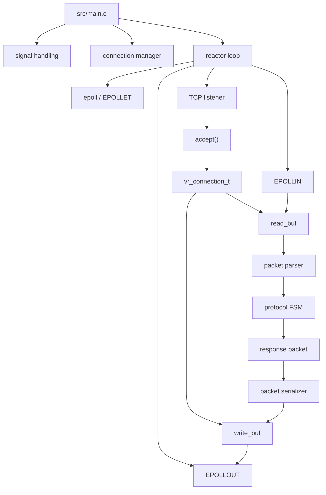
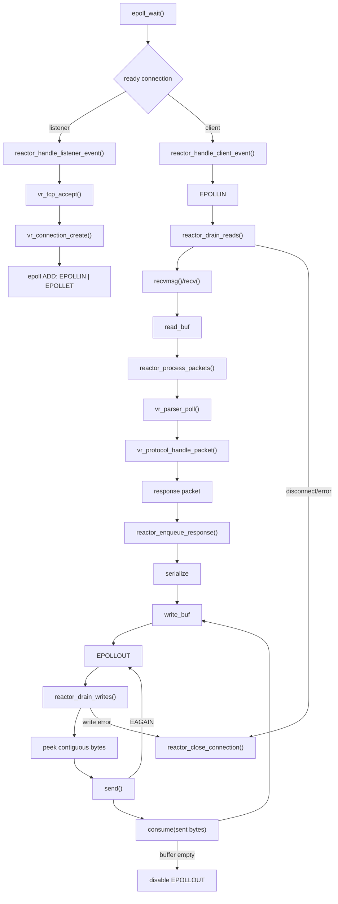
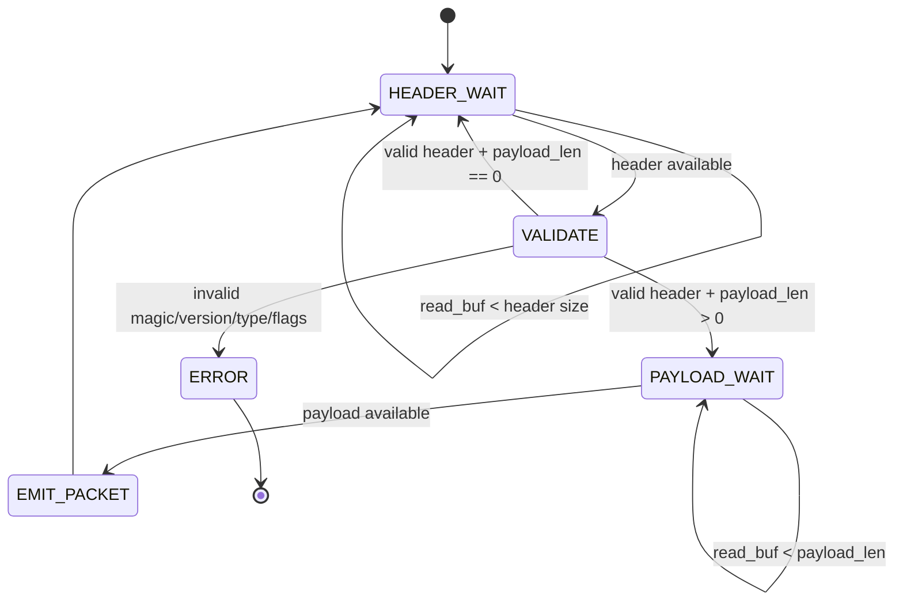
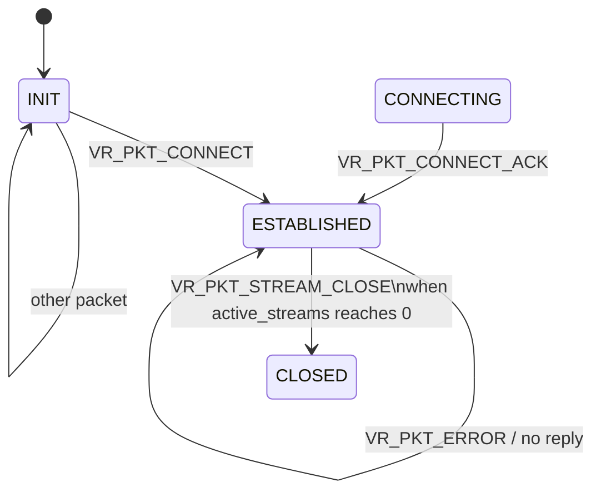

# Velora

Velora is a C-based event-driven TCP protocol engine built around Linux `epoll`, non-blocking sockets, per-connection state, dynamic ring buffers, and a custom binary packet protocol.

The current repository represents a **working baseline protocol/runtime engine** rather than a finished distributed messaging platform. The baseline already covers connection management, edge-triggered I/O, incremental packet parsing, protocol state transitions, buffered outbound writes, stream bookkeeping, malformed-packet rejection, and concurrent connection isolation.

---

## Current architecture



### Runtime layers

```text
Process
  └── main.c
      ├── signal handling
      ├── logger
      ├── connection manager
      └── reactor

Reactor
  ├── epoll lifecycle
  ├── listener handling
  ├── client read draining
  ├── client write draining
  ├── packet processing
  └── connection shutdown

Networking
  ├── TCP socket creation / bind / listen
  ├── accept
  ├── non-blocking sockets
  ├── recvmsg()/recv()
  └── send()

Connection
  ├── vr_connection_t
  ├── manager slot tracking
  ├── read buffer
  ├── write buffer
  ├── parser state
  ├── protocol state
  └── stream bitmap

Protocol
  ├── packet format
  ├── incremental parser
  ├── header validation
  ├── protocol FSM
  └── response generation
```

---

## End-to-end data path

The current reactor is split into explicit operations rather than keeping the entire client path inside one large event-loop branch.



The important event-loop invariant is:

```text
EPOLLIN  -> drain reads until EAGAIN
EPOLLOUT -> drain writes until EAGAIN
```

The sockets are non-blocking, so neither operation waits for the network. `epoll` provides the concurrency by multiplexing many connections through the same reactor thread.

---

# Packet format

Velora currently uses a fixed 8-byte packet header:

```text
+--------+---------+------+----------+-------+-------------+
| magic  | version | type | stream_id| flags | payload_len |
| 2 B    | 1 B     | 1 B  | 1 B      | 1 B   | 2 B         |
+--------+---------+------+----------+-------+-------------+
```

Current protocol constants:

```text
VR_MAGIC              = 0x5789
VR_PROTOCOL_VERSION   = 1
```

Maximum payload length is represented by the 16-bit `payload_len` field.

### Packet types

| Value | Packet |
|---:|---|
| 1 | `VR_PKT_CONNECT` |
| 2 | `VR_PKT_CONNECT_ACK` |
| 3 | `VR_PKT_PING` |
| 4 | `VR_PKT_PONG` |
| 5 | `VR_PKT_STREAM_OPEN` |
| 6 | `VR_PKT_STREAM_OPEN_ACK` |
| 7 | `VR_PKT_STREAM_CLOSE` |
| 8 | `VR_PKT_PUBLISH` |
| 9 | `VR_PKT_ERROR` |

### Packet flags

```text
VR_FLAG_NONE       = 0
VR_FLAG_COMPRESSED = 1 << 0
VR_FLAG_ACK_REQ    = 1 << 1
```

Only the defined flag bits are accepted by the parser.

---

# Packet / parser FSM

The packet parser is incremental because TCP is a byte stream rather than a message boundary transport.



### Parser behavior

1. Wait until at least one complete header is available.
2. Consume and deserialize the header.
3. Validate:
   - magic
   - version
   - packet type range
   - flag bits
4. If there is no payload, emit the packet immediately.
5. Otherwise wait for the complete payload.
6. Allocate the packet payload and copy bytes from the connection ring buffer.
7. Return a complete `vr_packet_t`.
8. Reset to `VR_PARSER_HEADER_WAIT`.

Malformed headers return `VR_ERROR`; the reactor treats that as a protocol violation and closes the connection.

---

# Protocol FSM

Protocol state is stored per connection in `vr_connection_t`.

Current protocol states:

```text
VR_PROTO_INIT
VR_PROTO_CONNECTING
VR_PROTO_ESTABILISHED
VR_PROTO_CLOSED
```

The server-side runtime currently enters through `VR_PROTO_INIT` and transitions to the established state after a valid `CONNECT`.



### Current protocol behavior

#### `CONNECT`

```text
INIT
  ↓
CONNECT
  ↓
CONNECT_ACK
  ↓
ESTABLISHED
```

The server establishes the default stream bookkeeping at this point.

#### `PING`

```text
ESTABLISHED
  ↓
PING
  ↓
PONG
```

#### `STREAM_OPEN`

```text
ESTABLISHED
  ↓
STREAM_OPEN
  ↓
allocate next free stream bit
  ↓
STREAM_OPEN_ACK(stream_id)
```

Streams are tracked using:

```text
uint64_t streams_bitmap[4]
uint8_t  active_streams
```

which gives the current implementation a 256-bit stream allocation space.

#### `PUBLISH`

`PUBLISH` is parsed and passed through the protocol layer without generating an application-level response in the current baseline.

#### `STREAM_CLOSE`

A stream-close clears the relevant stream bit and decrements `active_streams`.

When the last active stream is closed, the connection transitions to:

```text
VR_PROTO_CLOSED
```

The exact application-level acknowledgement semantics for `STREAM_CLOSE` remain a protocol-design item for the next iteration.

---

# Reactor architecture

The reactor has been modularized into separate responsibilities.

### Core reactor functions

```text
vr_reactor_create()
vr_reactor_destroy()
vr_reactor_add()
vr_reactor_modify()
vr_reactor_wait()
vr_reactor_remove()
vr_reactor_loop()
```

### Internal client-path helpers

```text
reactor_handle_client_event()
reactor_drain_reads()
reactor_process_packets()
reactor_enqueue_response()
reactor_drain_writes()
reactor_close_connection()
```

### Listener/bootstrap helpers

```text
reactor_handle_listener_event()
reactor_bootstrap_listener()
reactor_shutdown()
```

This separation keeps event notification separate from the actual read, process, write, and lifecycle operations.

---

# Read path

The receive side uses per-connection ring buffers.

```text
EPOLLIN
  ↓
reactor_drain_reads()
  ↓
vr_socket_recv_ring_buf()
  ↓
read_buf
  ↓
keep receiving until EAGAIN
```

The receive helper uses `recvmsg()` when the writable region wraps so that the kernel can fill up to two contiguous ring-buffer regions without an intermediate linearization buffer.

The ring buffer starts at:

```text
4096 bytes
```

and grows geometrically up to:

```text
65536 bytes
```

when incoming data exceeds the current capacity.

---

# Write path

Outgoing responses are serialized into the per-connection `write_buf`.

```text
response packet
      ↓
vr_packet_serialize()
      ↓
write_buf
      ↓
enable EPOLLOUT
      ↓
reactor_drain_writes()
      ↓
peek contiguous bytes
      ↓
send()
      ↓
consume exactly bytes accepted by kernel
      ↓
buffer empty?
   ├── yes → disable EPOLLOUT
   └── no  → wait for next writable event
```

Partial writes are handled by retaining unsent bytes in the ring buffer.

The write-side ring buffer exposes:

```text
vr_conn_ring_buf_contiguous_read()
vr_conn_ring_buf_consume()
```

so the reactor can avoid copying pending output before calling `send()`.

---

# Connection management

`vr_connection_t` currently contains:

```text
vr_net_conn_t                  net_conn
vr_connection_status_t         status
vr_connection_type_t           type
size_t                         slot
vr_connection_ring_buf_t       read_buf
vr_connection_ring_buf_t       write_buf
vr_parser_t                    parser
vr_protocol_state_t            proto_state
uint8_t                        active_streams
uint64_t                       streams_bitmap[4]
```

Connections are stored as pointers in a dynamic manager array:

```text
vr_connection_t **slots
```

This is important because epoll stores the connection pointer in:

```c
ev.data.ptr = conn;
```

The manager therefore moves pointers between slots rather than embedding connection objects directly inside a reallocating array.

Connection teardown also frees:

```text
read_buf.data
write_buf.data
vr_connection_t
```

and updates the manager's slot bookkeeping.

---

# TCP / socket layer

The networking layer is split between:

- `src/net/tcp_server.c`
- `src/net/socket_utils.c`

Responsibilities include:

```text
socket()
SO_REUSEADDR
bind()
listen()
accept()
fcntl(O_NONBLOCK)
recv()
recvmsg()
send()
```

The listener and accepted client sockets are all driven through the reactor using edge-triggered epoll.

The current default server port is:

```text
22409
```

---

# Logging and errors

Debug builds define:

```text
VR_DEBUG
```

and write logs to:

```text
log.txt
```

The debug logger currently uses a mutex around log writes.

Release builds disable the logger implementation.

Build flags are currently:

```text
Debug:
-DVR_DEBUG -g

Release:
-O3
```

The Makefile also enables:

```text
-Wall -Wextra -pthread
```

---

# Tests currently in the repository

The repository contains executable shell-based integration/stress tests under [`tests`](tests).

### `tests/overall_single.sh`

Single-connection FSM smoke test.

Exercises:

```text
CONNECT -> CONNECT_ACK
PING -> PONG
STREAM_OPEN -> STREAM_OPEN_ACK
STREAM_CLOSE
```

### `tests/parser_walk.sh`

Broad parser/protocol integration suite.

Current checks include:

```text
fragmented header + payload assembly
pipelined burst
large payload / ring-buffer growth
full FSM walk
invalid magic
invalid version
unknown packet type
invalid flag bits
multiple concurrent connections
```

The current baseline has reached:

```text
9/9 checks passed
```

### `tests/conn_count.sh`

Creates and holds a configurable number of concurrent TCP connections.

Default:

```text
10000
```

### `tests/churn.sh`

Sequential connect/disconnect churn.

Default:

```text
10000 cycles
```

### `tests/concurrent_churn.sh`

Opens a configurable number of simultaneous connections and holds them until interrupted.

Default:

```text
5000 connections
```

### `tests/slowloris.sh`

Keeps a large group of TCP clients alive and periodically attempts small writes to exercise long-lived connections.

Default:

```text
1000 clients
```

---

# Running Velora

## Build

Debug build:

```bash
make debug
```

Release build:

```bash
make release
```

The binary is produced at:

```text
build/velora
```

## Start

```bash
./build/velora
```

The server listens on:

```text
127.0.0.1:22409
```

for local tests.

## Run protocol regression

```bash
./tests/overall_single.sh
./tests/parser_walk.sh
```

## Run concurrent connection test

```bash
./tests/conn_count.sh 10000
```

## Run sequential churn

```bash
./tests/churn.sh 10000
```

## Run concurrent connections

```bash
./tests/concurrent_churn.sh 5000
```

## Run slow-client style workload

```bash
./tests/slowloris.sh 1000
```

---

# Baseline verification

The current test suite has already verified the following classes of behavior:

```text
✅ CONNECT / ACK end-to-end path
✅ PING / PONG
✅ STREAM_OPEN / STREAM_OPEN_ACK
✅ fragmented packet delivery
✅ pipelined packets
✅ large payload handling
✅ ring-buffer growth
✅ malformed packet rejection
✅ parser reset / resynchronization
✅ per-connection FSM isolation
✅ concurrent connections
✅ buffered response writes
✅ edge-triggered read draining
✅ edge-triggered write draining
```

This establishes the current system as a **functional baseline** for subsequent performance and systems research.

---

# Current limitations / known protocol-design gaps

Velora is intentionally still a baseline engine.

The current implementation does **not** yet include:

```text
worker thread runtime
MPSC queues
backpressure policies
broker/pub-sub subsystem
RPC layer
memory pools
zero-copy message pipeline
custom scheduler
kernel-bypass networking
AF_XDP / DPDK integration
advanced observability
multi-node distributed routing
```

These are future research/engineering directions rather than claims about the current implementation.

One protocol item also remains intentionally visible:

```text
STREAM_CLOSE acknowledgement semantics
```

The current baseline updates stream bookkeeping and can transition the connection to `VR_PROTO_CLOSED` when the last active stream closes, but a dedicated close acknowledgement packet is not currently defined.

---

# Current baseline architecture

The current system can be summarized as:

```text
             ┌───────────────────────────┐
             │        Velora Server      │
             └─────────────┬─────────────┘
                           │
                    edge-triggered
                       epoll loop
                           │
            ┌──────────────┴──────────────┐
            │                             │
         EPOLLIN                       EPOLLOUT
            │                             │
      drain socket                 drain write_buf
            │                             │
        read_buf                    send until EAGAIN
            │                             │
      packet parser                    consume
            │
       protocol FSM
            │
      response packet
            │
       serialize
            │
        write_buf
```

This is the baseline on which optimization and research work should be measured.

---

# Research direction

The baseline intentionally provides a clean control implementation for later experimentation.

Potential next-stage areas include:

```text
1. protocol parsing / serialization cost
2. ring-buffer efficiency
3. memory allocation and pooling
4. zero-copy message handling
5. reactor scheduling
6. MPSC worker queues
7. CPU/core scalability
8. backpressure
9. batching
10. kernel-bypass networking
11. AF_XDP / DPDK
12. observability and performance instrumentation
```

The intended workflow is:

```text
baseline
   ↓
measure
   ↓
identify bottleneck
   ↓
change one subsystem
   ↓
benchmark
   ↓
compare against baseline
```

---

# Repository layout

```text
Velora/
├── include/
│   ├── shared/
│   │   └── utilities.h
│   └── velora/
│       ├── common.h
│       ├── conn.h
│       ├── error.h
│       ├── logger.h
│       ├── net.h
│       ├── packet.h
│       ├── parser.h
│       ├── protocol.h
│       ├── reactor.h
│       └── socket_utils.h
│
├── src/
│   ├── conn/
│   │   ├── conn.c
│   │   └── ring_buffer.c
│   ├── core/
│   │   ├── error.c
│   │   └── logger.c
│   ├── event_loop/
│   │   └── reactor.c
│   ├── net/
│   │   ├── socket_utils.c
│   │   └── tcp_server.c
│   ├── protocol/
│   │   ├── packet.c
│   │   ├── parser.c
│   │   └── protocol.c
│   ├── shared/
│   │   └── utilities.c
│   └── main.c
│
├── tests/
│   ├── churn.sh
│   ├── concurrent_churn.sh
│   ├── conn_count.sh
│   ├── overall_single.sh
│   ├── parser_walk.sh
│   └── slowloris.sh
│
├── Makefile
├── LICENSE
└── README.md
```

---

# Status

**Baseline engine: functional**

The current milestone is deliberately focused:

> Make the transport, buffering, parser, protocol FSM, and reactor behavior correct and measurable before introducing the next layer of performance-oriented systems research.
