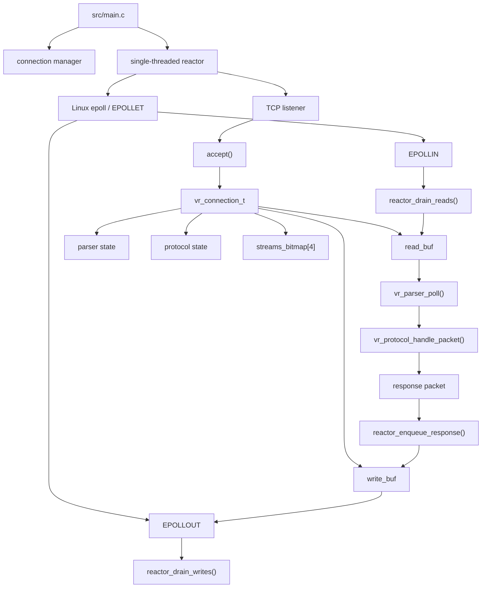
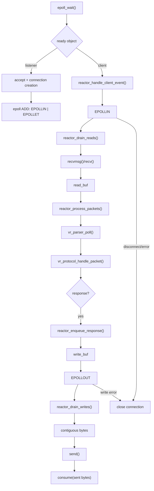
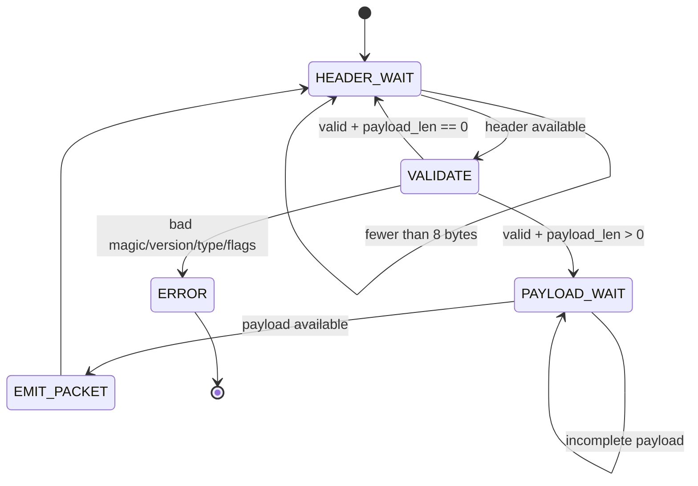
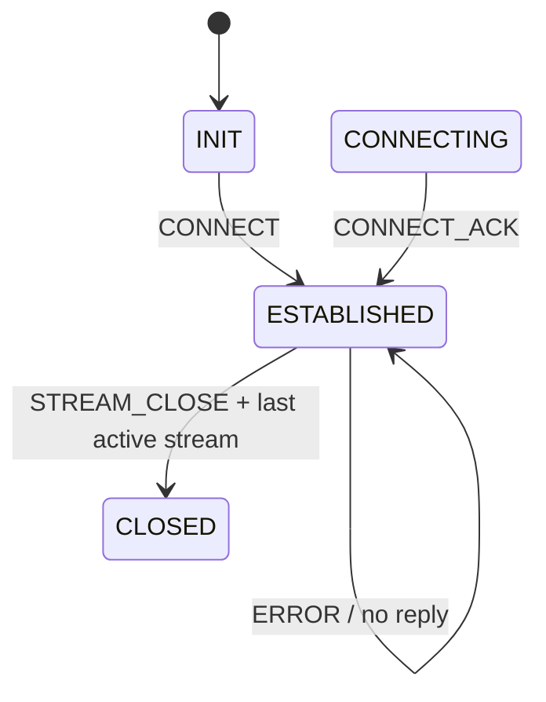
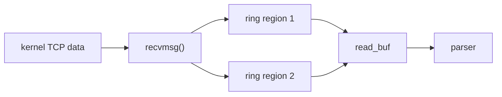
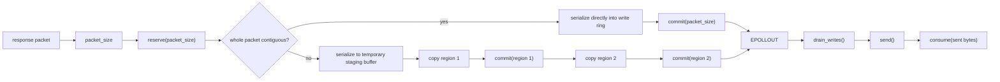

# Velora

**Velora** is a C-based, event-driven TCP protocol engine built around Linux `epoll`, non-blocking sockets, per-connection state, dynamic ring buffers, and a custom binary protocol.

The repository currently contains a **working single-threaded protocol/runtime engine**. It is intentionally not yet a distributed broker, RPC framework, or multi-worker runtime. The current milestone is a fast, testable control implementation for packet parsing, buffering, reactor behavior, connection scaling, and later multicore/networking experiments.

## Current status

| Area | Current state |
|---|---|
| Transport | Non-blocking TCP |
| Event model | Single-threaded Linux `epoll` + `EPOLLET` |
| Connection state | Per-connection object + pointer-based connection manager |
| Receive buffering | Dynamic ring buffer; `recvmsg()` can fill two physical regions directly |
| Parser | Incremental header/payload FSM with bulk contiguous fast paths |
| Write buffering | Ring buffer with `reserve`/`commit` + contiguous serialization |
| Protocol | 8-byte binary header, 9 packet types, flags, per-connection stream bookkeeping |
| Streams | 256-bit bitmap (`uint64_t streams_bitmap[4]`) |
| Concurrency validation | 10,000 concurrent TCP connections |
| Protocol regression | **9/9 checks passed** |
| End-to-end throughput | **~298k completed PING/PONG transactions/s** @ 10k connections |
| Packet throughput | **~1.90M sustained PUBLISH pkt/s** @ 10k connections; observed peak ~2.3M pkt/s |
| Multithreading | Not implemented |
| Broker/pub-sub | Not implemented |
| Backpressure subsystem | Not implemented |
| Kernel bypass | Not implemented |

Performance figures are black-box measurements from external C clients on a local Linux test environment; they are benchmark results, not hardware-independent limits.

---

# Architecture



## Runtime data path



The core invariant is:

```text
EPOLLIN  -> drain reads until EAGAIN
EPOLLOUT -> drain writes until EAGAIN
```

---

# Packet format

Velora uses a fixed 8-byte header:

```text
+--------+---------+------+----------+-------+-------------+
| magic  | version | type | stream_id| flags | payload_len |
| 2 B    | 1 B     | 1 B  | 1 B      | 1 B   | 2 B         |
+--------+---------+------+----------+-------+-------------+
```

```text
VR_MAGIC            = 0x5789
VR_PROTOCOL_VERSION = 1
```

`payload_len` is 16-bit, allowing wire payload descriptions up to 65,535 bytes.

### Packet types

| Value | Packet |
|---:|---|
| 1 | `VR_PKT_CONNECT` |
| 2 | `VR_PKT_CONNECT_ACK` |
| 3 | `VR_PKT_PING` |
| 4 | `VR_PKT_PONG` |
| 5 | `VR_PKT_STREAM_OPEN` |
| 6 | `VR_PKT_STREAM_OPEN_ACK` |
| 7 | `VR_PKT_STREAM_CLOSE` |
| 8 | `VR_PKT_PUBLISH` |
| 9 | `VR_PKT_ERROR` |

### Flags

```text
VR_FLAG_NONE       = 0
VR_FLAG_COMPRESSED = 1 << 0
VR_FLAG_ACK_REQ    = 1 << 1
```

Unknown flag bits are rejected by the parser.

---

# Packet/parser FSM

TCP does not preserve application packet boundaries, so the parser is incremental.



### Current parser path

```text
HEADER_WAIT
    |
    +-- contiguous header --> deserialize directly from ring
    |
    +-- wrapped header ----> peek_n() + small stack buffer
    |
    +-- consume header once
    v
VALIDATE
    |
    +-- invalid --> VR_ERROR -> reactor closes connection
    |
    +-- no payload --> emit packet
    |
    v
PAYLOAD_WAIT
    |
    +-- contiguous payload --> one memcpy()
    |
    +-- wrapped payload ----> peek_n() / at most two copies
    |
    +-- consume payload once
    v
HEADER_WAIT
```

The current Stage 1 optimization removes byte-by-byte header/payload extraction from the parser while preserving the existing FSM and packet ownership model.

---

# Protocol FSM

Protocol state is stored per connection.

```text
VR_PROTO_INIT
VR_PROTO_CONNECTING
VR_PROTO_ESTABILISHED
VR_PROTO_CLOSED
```

The current server-side path starts in `VR_PROTO_INIT` and enters the established state after `CONNECT`.



### Streams

Each connection contains:

```c
uint8_t active_streams;
uint64_t streams_bitmap[4];
```

The bitmap provides a 256-bit stream allocation space.

`STREAM_OPEN` allocates the next free stream bit and returns `STREAM_OPEN_ACK`.

`STREAM_CLOSE` clears the stream bit and decrements `active_streams`. When the last stream is removed, the protocol state becomes `VR_PROTO_CLOSED`.

`STREAM_CLOSE` acknowledgement semantics are still not finalized.

---

# Ring buffers

Each connection owns:

```text
read_buf
write_buf
```

The current ring representation tracks:

```text
data
capacity
count
read_pos
write_pos
state
```

Current capacities:

```text
initial = 4096 bytes
maximum = 65536 bytes
```

Growth is geometric up to the configured ceiling.

## Receive path

The socket receive helper can write directly into up to two physical ring regions with `recvmsg()`:



## Bulk ring API

The current ring buffer exposes:

```text
vr_conn_ring_buf_contiguous_read()
vr_conn_ring_buf_consume()

vr_conn_ring_buf_peek_n()
vr_conn_ring_buf_contiguous_write()
vr_conn_ring_buf_commit()
vr_conn_ring_buf_reserve()
```

The hot paths now operate on **spans and byte counts**, rather than repeated `push()`/`pop()` calls.

---

# Write path

The response enqueue path now mirrors the bulk read design:



The old byte-at-a-time response serialization path has been removed from the hot path.

The fast path can serialize a response directly into its final ring-buffer location. The wrap path uses at most two bulk copies.

---

# Connection management

`vr_connection_t` contains:

```text
vr_net_conn_t
status
type
slot
read_buf
write_buf
parser
proto_state
active_streams
streams_bitmap[4]
```

The manager stores stable pointers:

```text
vr_connection_t **slots
```

because epoll keeps the connection pointer in:

```c
ev.data.ptr = conn;
```

Connection teardown removes the fd from epoll, closes the socket, frees ring-buffer storage, and updates the manager's slot bookkeeping.

---

# Tests

## `tests/overall_single.sh`

Single-connection protocol smoke test:

```text
CONNECT -> CONNECT_ACK
PING -> PONG
STREAM_OPEN -> STREAM_OPEN_ACK
STREAM_CLOSE
```

## `tests/parser_walk.sh`

Current regression suite:

```text
1. fragmented header + payload
2. pipelined burst
3. large payload / ring-buffer growth
4. full FSM walk
5. bad magic
6. bad version
7. unknown packet type
8. invalid flags
9. concurrent connection isolation
```

Current result:

```text
9/9 checks passed
```

## `tests/conn_count.sh`

Concurrent connection holding test.

Typical run:

```bash
./tests/conn_count.sh 10000
```

## `tests/churn.sh`

Repeated sequential connect/disconnect cycles.

```bash
./tests/churn.sh 10000
```

## `tests/concurrent_churn.sh`

Concurrent connection churn workload.

```bash
./tests/concurrent_churn.sh 5000
```

## `tests/slowloris.sh`

Protocol-aware slow-client workload. It sends valid fragmented protocol data rather than arbitrary bytes, so it exercises the current incremental parser FSM.

```bash
./tests/slowloris.sh 10000
```

---

# Black-box performance benchmarks

The performance clients do **not** modify Velora. A message is counted only after externally observable protocol behavior confirms processing.

## PING/PONG throughput

Source:

```text
tests/throughput_pingpong.c
```

Build:

```bash
gcc -D_POSIX_C_SOURCE=200809L -O3 -Wall -Wextra -Wpedantic \
    -o tests/throughput_pingpong tests/throughput_pingpong.c
```

Run:

```bash
./tests/throughput_pingpong 127.0.0.1 22409 10000 16 30
```

A transaction counts only when a valid `PONG` reaches the client.

Observed baseline:

```text
10,000 concurrent connections
~298k completed PING/PONG transactions/s
0 errors
0 connection loss
```

This is an end-to-end request/response metric.

## Packet-processing throughput

Source:

```text
tests/packet_throughput.c
```

Workload:

```text
CONNECT
   |
PUBLISH × N
   |
PING marker
   |
PONG
```

The client only counts a sequence after the marker PONG arrives, so the PUBLISH packets preceding the marker must have crossed the parser/protocol path first.

Build:

```bash
gcc -D_POSIX_C_SOURCE=200809L -O3 -Wall -Wextra -Wpedantic \
    -o tests/packet_throughput tests/packet_throughput.c
```

Run:

```bash
./tests/packet_throughput 127.0.0.1 22409 10000 64 64 30
```

Observed repeated baseline:

```text
Connections              : 10,000
PUBLISH packets/sequence : 64
Payload                  : 64 bytes
Sustained PUBLISH rate   : ~1.90M pkt/s
Total confirmed rate     : ~1.93M pkt/s
Observed peak            : ~2.3M pkt/s
Errors                   : 0
Connection loss          : 0
```

The sustained rate is the meaningful baseline; the early peak is reported separately because the run settles into steady state.

This is a **black-box protocol-path throughput benchmark**, not an isolated parser microbenchmark.

---

# Benchmark interpretation

Keep these metrics separate:

```text
PING/PONG throughput
    = completed application request/response transactions

PUBLISH packet throughput
    = confirmed PUBLISH packets in
      PUBLISH...PUBLISH -> PING -> PONG sequences

Connection concurrency
    = simultaneously established TCP connections

Slow-client resilience
    = ability to maintain many connections
      while data arrives incrementally
```

Do not compare these numbers as if they measured the same workload.

---

# Repository layout

```text
Velora/
├── include/
│   ├── shared/
│   │   └── utilities.h
│   └── velora/
│       ├── common.h
│       ├── conn.h
│       ├── error.h
│       ├── logger.h
│       ├── net.h
│       ├── packet.h
│       ├── parser.h
│       ├── protocol.h
│       ├── reactor.h
│       └── socket_utils.h
│
├── src/
│   ├── conn/
│   │   ├── conn.c
│   │   └── ring_buffer.c
│   ├── core/
│   │   ├── error.c
│   │   └── logger.c
│   ├── event_loop/
│   │   └── reactor.c
│   ├── net/
│   │   ├── socket_utils.c
│   │   └── tcp_server.c
│   ├── protocol/
│   │   ├── packet.c
│   │   ├── parser.c
│   │   └── protocol.c
│   ├── shared/
│   │   └── utilities.c
│   └── main.c
│
├── tests/
│   ├── churn.sh
│   ├── concurrent_churn.sh
│   ├── conn_count.sh
│   ├── overall_single.sh
│   ├── packet_throughput.c
│   ├── parser_walk.sh
│   ├── slowloris.sh
│   ├── throughput.sh
│   ├── throughput_c.c
│   └── throughput_pingpong.c
│
├── Makefile
├── LICENSE
└── README.md
```

The repository may also contain locally generated binaries such as `build/velora` and compiled benchmark clients.

---

# Build

Debug:

```bash
make debug
```

Release:

```bash
make release
```

The Makefile uses:

```text
Debug   : -DVR_DEBUG -g
Release : -O3
Common  : -Wall -Wextra -Iinclude -pthread
```

The production benchmark path should use the release build.

---

# Run

```bash
make release
./build/velora
```

Default local test address:

```text
127.0.0.1:22409
```

Regression:

```bash
./tests/overall_single.sh
./tests/parser_walk.sh
```

Connections:

```bash
./tests/conn_count.sh 10000
```

Packet benchmark:

```bash
./tests/packet_throughput 127.0.0.1 22409 10000 64 64 30
```

PING/PONG benchmark:

```bash
./tests/throughput_pingpong 127.0.0.1 22409 10000 16 30
```

---

# Known limitations

The current engine does **not** yet include:

```text
worker-thread runtime
MPSC queues
multicore reactor scaling
broker/pub-sub subsystem
RPC subsystem
general backpressure policies
memory pools / arenas
true borrowed-payload zero-copy pipeline
custom scheduler
kernel-bypass networking
AF_XDP / DPDK integration
multi-node routing
distributed state
production-grade observability
```

Current protocol/data-plane limitations include:

```text
maximum ring capacity: 65536 bytes
maximum wire packet: 65543 bytes
PUBLISH currently produces no application response
STREAM_CLOSE acknowledgement semantics are not finalized
parsed payloads are still heap-owned and copied out of the read ring
```

---

# Development direction

The current baseline is intentionally optimized incrementally:


The engineering loop is:

```text
measure
   ↓
identify bottleneck
   ↓
change one subsystem
   ↓
regression test
   ↓
benchmark
   ↓
compare against baseline
```

The current single-threaded reactor remains the control implementation for future multicore and networking experiments.

---

# Status

**Current milestone: optimized single-threaded protocol/runtime baseline.**

```text
✓ non-blocking TCP
✓ edge-triggered epoll reactor
✓ stable per-connection state
✓ dynamic ring buffers
✓ direct kernel -> ring receive path
✓ bulk parser header handling
✓ bulk parser payload extraction
✓ bulk response enqueue path
✓ incremental packet FSM
✓ protocol FSM
✓ 256-bit stream bookkeeping
✓ malformed packet rejection
✓ fragmented packet handling
✓ pipelined packet handling
✓ 10,000-connection validation
✓ 9/9 parser/FSM regression checks
✓ black-box PING/PONG throughput benchmark
✓ black-box packet-processing throughput benchmark
```

The next major architectural step is **multicore execution**, built on top of this measured single-threaded baseline.